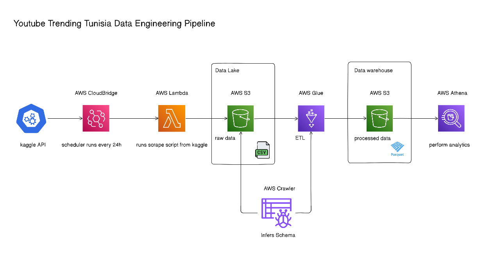

# Tunisia YouTube Trending – AWS Data Engineering Project

This project implements an end-to-end data engineering pipeline on AWS to ingest Tunisia trending YouTube videos daily, transform the data using AWS Glue, and make it query-ready for analytics.

---

## Architecture

---

## Project Goal

The goal of this project is to simulate a real-world cloud Data Lake architecture:

- Ingest daily raw YouTube trending data into Amazon S3  
- Store raw files partitioned by `ingestion_date`  
- Transform and structure the data using AWS Glue
- Produce optimized, analytics-ready datasets in Parquet format  

---

## Data Transformations (AWS Glue)

The AWS Glue ETL job performs structured transformations on the raw CSV data:

- Applies an explicit schema to enforce correct data types  
- Reduces the dataset from **26 raw attributes to 13 analytical attributes**  
- Selects only relevant fields (video metadata, category information, engagement metrics, country, ingestion date)  
- Writes the output in **Parquet format** for performance optimization  
